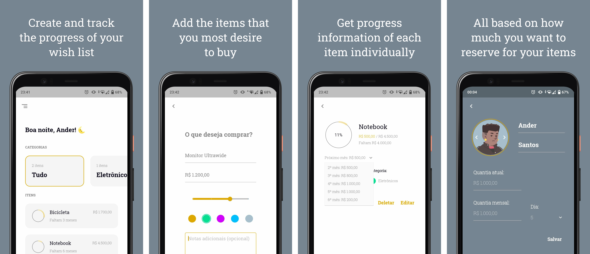

# Buyit - Smart Wish List

Buyit is a flutter app focused on progress and organization of your wish list and highly centered on design and user experience. Here you can set your desired items and knowing your monthly income destined for your list the app will calculte everything about it, make predictions and keep track of your progress.

# Buyit - Construction

The app is currently not open source, but I can talk a little about its construction process.

I made this app to work as a portfolio, and, in addition to testing my design skills, I created the widgets and animations from scratch to have greater customization and a more standardized design system, from there I think I achieved my goal of creating an app with a beautiful and fluid design and smooth animations, using the default widgets and animations of flutter and some math with bezier curves and all of that I could achieve it. Below you can see some results.

Left menu, [DotsPicker](https://github.com/underfilho/DotsPicker) and floating tips.

  
  
  

In addition to the design there is also much more, the app is currently almost entirely offline, so all the math and calculations of the items are made locally, so to keep the project organized I rewrite the app months ago using clean architecture and some design patterns. 

Right now I'm using some packages like get_it, provider, workmanager, sqflite and now I'm implementing online notifications with Firebase Cloud Messaging and a simple node.js backend to create and send the desired notifications.
